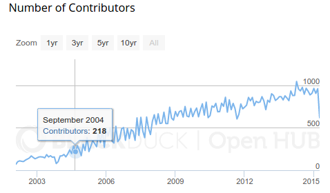
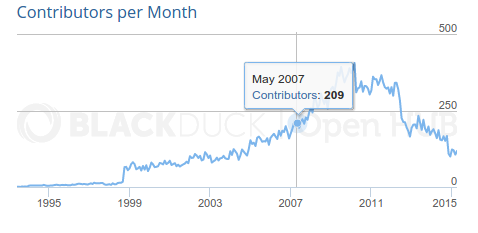
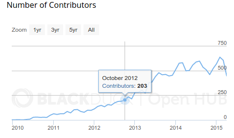
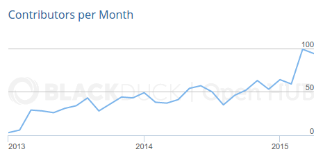
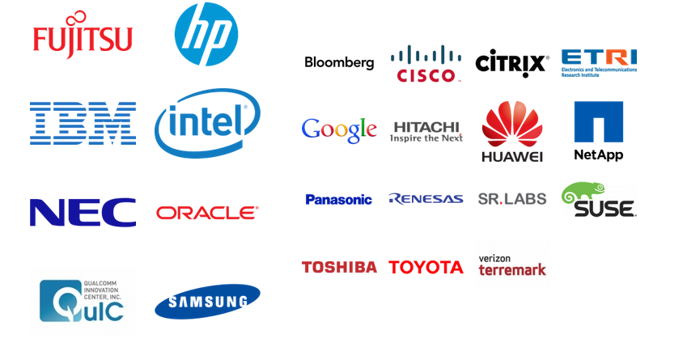
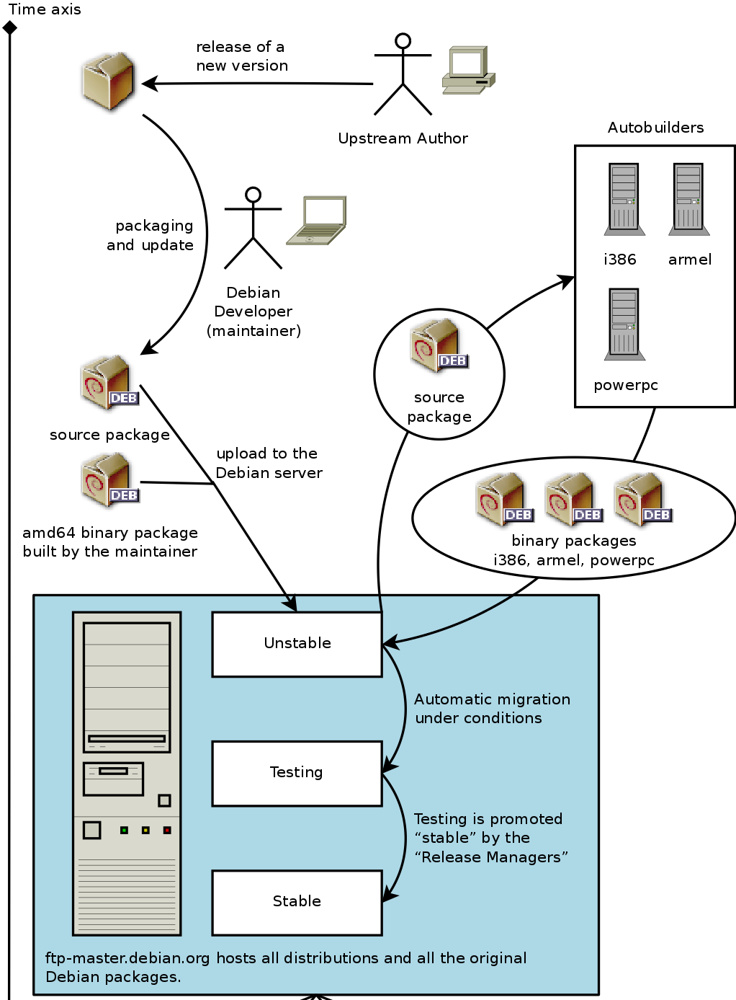
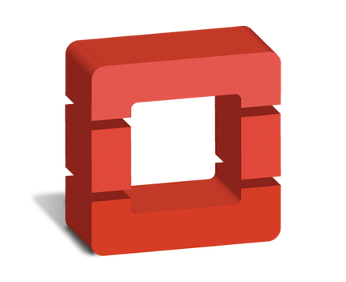
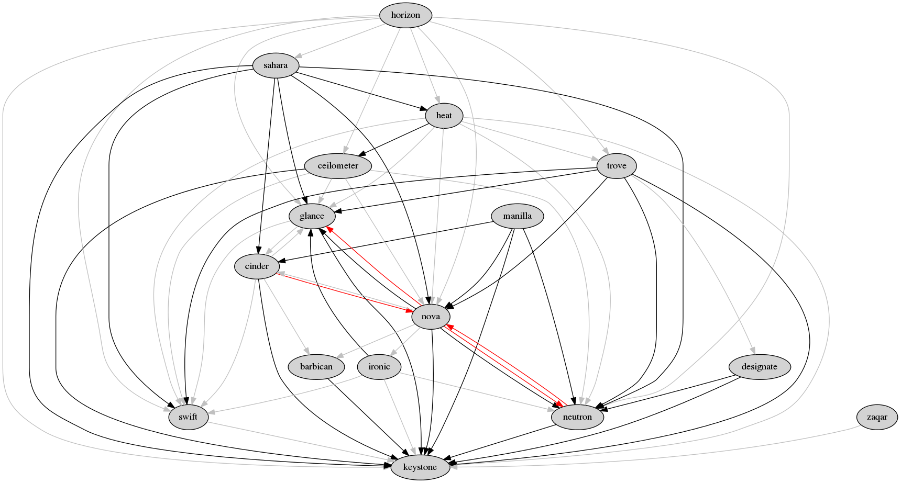
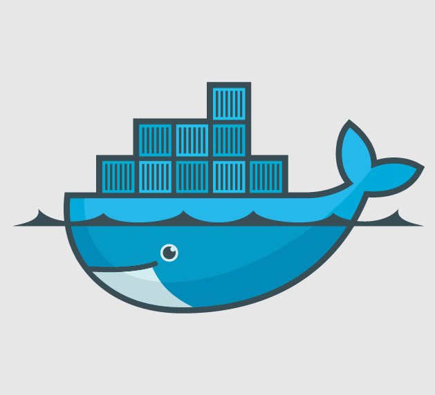
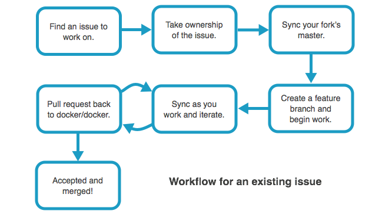

# Large Scale Open Source Development Models
### A Comparative Analysis

<!--
abstract:
Managing an open source project with a small handful of developers is easy. But what happens when your project grows in popularity and you need to scale out your development model and tooling? Many projects have successfully made this leap with very different development models and tooling, so what is right for you? This talk will cover the development models of large projects such as the Linux Kernel, Apache Software Foundation, Debian and OpenStack, what worked, what didn't and what other projects can learn.

-->

<small>By Joe Gordon</small>
---

## About Me

* OpenStack Developer at HP
* Hacking on OpenStack for 4 years
* contact information
    * jogo on freenode
    *  [github.com/jogo](https://github.com/jogo)

---

## Why

* Saw OpenStack grow from around 60 developers to 2,000 developers
* Unusual development model
* But how do other projects solve the same problems?

<!--
Why is there so little information on this?

-->
---

# Why is Picking the Right Development Model Important?

---

## Accelerating Growth

* Linux kernel
    * 2 years to reach 100 contributors in 1991
    * Linux 2.0 had 190 contributors in 1996  in credits
* OpenStack took 1 year to reach 100 contributors in 2010
* Docker had over 300 contributors in its first year in 2013
* 200 contributors per month
    * Linux: 1991 - June 2004 (13 years)
    * Debian: 1993 - March 2007 (14 years)
    * OpenStack: 2010 - October 2012 (2 years)

===

## Accelerating Growth

<small>Linux, Debian,  Docker, OpenStack (clockwise from top left)  
source: [openhub](https://www.openhub.net)</small> 

---

## Open Source is Big Business

* Open source instead of standard bodies
* Balancing corporate interests

<small>Linux foundation Gold and Platinum Members</small>

---

## Picking the Right Development Model

### Conway's Law

>  organizations which design systems ... are constrained to produce designs which are copies of the communication structures of these organizations

---

# Development Models

---

## Projects Covered

* Linux Kernel
* Apache Software Foundation
* Debian
* OpenStack
* Docker

<!--
All of them are building very different things. Differing degrees of cohesiveness in product.
-->

---

# [Linux Kernel](https://www.kernel.org/doc/Documentation/development-process/2.Process)

===

### Release

* Time based release model (2-3 months)
* Rolling development model, continually integrating major changes
* Separate stable team
* Release single artifact
* Rarely consumed directly by end users

<!--

* Merge window (rate of 1,000 changes per day). After that next 6 - 10 weeks are mainly to changes that fix problems.

* Produce a single 'thing', but almost never directly consumed by end users.
  Lots and lots of completely isolated components (drivers)

-->

===

### Scaling Model

* Per month
    * 1,000 contributors
    * 5,000 to 7,000 patches
* Lieutenants / subsystem maintainers
    * About 1,000 maintainers
* Chain of Trust
* No elections for technical positions
* Decentralized review process
    * each maintainer has their own git tree
* Only about 1% of patches are directly merged by BDFL

===

### Hierarchy

1. BDFL
2. Subsystem maintainers
3. Sub-subsystem maintainers
4. Sub-sub-subsystem maintainers
5. Contributors

===

### Tooling

* Communication
    * mailing lists
* Git
* No automated pre-commit CI
* Code review
    * decentralized
    * more mailing lists

===

### Life of a Patch

*Process can be quick for minor fixes or take years for controversial changes*

1. Design
    * Prefer in the open, but not required
2. Early review via mailing list
    * Submit patches via email
3. Wider review, accepted  by a subsystem maintainer's tree and into the -next trees.
4. Merged into mainline

===

### Culture

* Chain of trust
* About the individual
* Value frankness over politeness
* Corporate friendly
* No single company controls
* Not much automated pre commit testing

---

# [Apache Software Foundation](https://www.apache.org/foundation/how-it-works.html)

===

### Release

* Over 300 separate releases
* ASF is more of an umbrella and culture
* Each project does its own thing

===

### Scaling Model

* Separate projects
    * 4,431 committers
    * 150+ top level projects
* 740 contributors in past 12 months?
* In project scaling up to each project
    * Apache Spark had 570 contributors in past 12 months
    * OpenOffice had 31
* flat (ish) trust model
* 'Review then commit' vs. 'commit then review'
*

    In order to reduce friction and allow for diversity to emerge, rather than forcing
    a monoculture from the top ... each project is delegated authority over development
    of its software, and is given a great deal of latitude in designing its own technical
    charter and its own governing rules.

===

### Hierarchy

1. ASF Member
2. Project Management Committee
    * Makes technical decisions
3. committer
3. developer

    When the group felt that the person had "earned" the merit to be part of the
    development community, they granted direct access to the code repository, thus
    increasing the group and increasing the ability of the group to develop the
    program, and to maintain and develop it more effectively.
===

### Tooling

* Communication
    * mailing list
* SVN
* Optional CI
* Central review system: [Review Board](https://reviews.apache.org/r/)
* Lazy consensus

>    If it didn't happen on a mailing list, it didn't happen.

===

### Life of a Patch

* *Review then commit* or *commit then review*.
* Different projects have different review flows
* [Review Board](https://reviews.apache.org/r/)

===

### Culture

* Lazy consensus
* Focus is on the team
    * All decisions are team based
* Focus is on contributors not companies
* No monoculture

>   Within the ASF we worry about any community which centers around a few individuals who are working virtually uncontested.

---

# Debian

<!--
StevenK:

    I think the maintainers are both the biggest strength and greatest weakness of
    Debian.  Working together, we pull off some amazing things for a distribution of our size.
    And then you get the morons who don't want to update their packages, don't accept
    NMUs, and don't reply to bug reports.
    There is no centralized code review, or for lack of a better word,
    forced CI - the onus is on the maintainers rather than automated systems to ensure
    quality

-->

===

### Release

When its ready, not time based. Notoriously slow

* Every 2 years
* Lots and lots of artifacts
* Unstable, Testing, Stable

===

### Scaling Model

Package Maintainers

* 3,200 Debian Developers
* Can have individual maintainers or groups (via a mailing list)
* No review, trust/burden maintainers more

===

### Hierarchy

Roles:

* **Maintainer**: the person making the Debian package of the program.
* **Sponsor**: a person who helps maintainers to upload packages to the official Debian package archive (after checking their contents).
* **Debian Developer (DD)**: a member of the Debian project with full upload rights to the official Debian package archive.
* **Debian Maintainer (DM)**: a person with limited upload rights to the official Debian package archive.

===

### Tooling

* Communication
    * Mailing list
    * Web services
    * Lots of IRC
* Poor automated testing
    * Quality control is ultimately to individual maintainers
    * Half of the CI available isn't official
* No peer review system
    * Except for new packages (FTP Masters)

===

### Life of a Package

<!--

FTP Master approved new package
Note:  Any Debian Developer can push a new version of a package but can cause trouble with the maintainer.

-->

===

### Culture

* Rotating leadership (elections)
* Do-ocracy: *An individual Developer may make any technical or nontechnical decision with regard to their own work*
* Open development
* Independent not 'profit-driven':  *no imposed decisions by who has money, infrastructure, people*
* *no benevolent dictator, no oligarchy*
* It is all about the individual (although individual's can form groups)
* Territorial

---

# OpenStack

===

### Release

* Time based, every 6 months
* Continuous delivery
* Set of separate but related projects.
    * Usually 1 way dependencies
* Lots of artifacts
* Sometimes consumed directly by consumers (without distro)
* No rolling development, freeze development on master before a release

===

<!--
At first OpenStack was an 'integrated release' of several projects. But coordinating a single integrated release became harder as OpenStack grew. Moving to model of more loosely integrated components that have a less integrated release cycle.

Starting to evolve

-->

===

### Scaling Model

* Break down repositories and build teams around each repository
    * 31 teams
    * 150+ repositories
    * 5,000 commits per month from 500 contributors
    * 282 core developers
* Flat trust model
* Strong centralized review process (two core reviews)
* Automated testing to reduce reviewer burden
* Having trouble with scaling the team responsible for a single repository
    *  Can't get past 15 or so members on a core team

===

### Hierarchy

Flat as possible

1. TC
2. PTL
3. Core Teams

===

### Tooling

* Communication
    * Mailing lists
    * IRC
    * Code reviews
* Git
* Code review: [Gerrit](review.openstack.org)
* Lots and lots of automated testing
* In person design summits twice a year

===

### Life of a Patch

===

### Culture

* Group over individual
* Egalitarian
* Elections
* Welcoming to new contributors
* Corporate friendly
* Not controlled by single company
* Lazy consensus
* Decentralized design

===

### Culture

#### [OpenStack's 4 Opens](https://wiki.openstack.org/wiki/Open)

* Open *Source*, not open core
* Open *Design*
* Open *Development*
* Open *Community*
    * Lazy consensus
    * technical governance is a meritocracy
    * put everything in the public

===

### Factors Limiting Growth

* Cross project issues
* Team size
* Single vision

---

# [Docker](https://github.com/docker/docker/blob/master/MAINTAINERS)

<small>'Github' development model</small> 

===

### Release

* Every 2 Months
* separate release branch
    * master isn't frozen

===

### Scaling Model

* 37 maintainers in Docker
* 10-15 repos in total
* Maintainers / subsystem maintainers
    * <small>Have to submit a pull request when going on vacation!</small>
* No don't direct push
* Centralized review in github

    1) They share responsibility in the project's success.
    2) They have made a long-term, recurring time investment to improve the project.
    3) They spend that time doing whatever needs to be done, not necessarily what
    is the most interesting or fun."

    This "cellular division" is the primary mechanism for scaling maintenance of the
    project as it grows.

<!--
Not followed

    A change requires LGTMs from an absolute majority of the maintainers of each
    component affected.

-->

===

### Hierarchy

1. BDFL
2. Project Leader (day to day work)
3. Core maintainers
4. Subsystem Maintainers
5. Contributors

===

### BDFL

    Ideally, the BDFL role is like the Queen of England: awesome crown, but not
    an actual operational role day-to-day. The real job of a BDFL is to NEVER GO AWAY.
    ... the BDFL will always be there, preserving the philosophy and principles of the
    project, and keeping ultimate authority over its fate. This gives us great
    flexibility in experimenting with various governance models, knowing that we can
    always press the "reset" button without fear of fragmentation or deadlock. See the
    US congress for a counter-example.

    BDFL daily routine:

    * Is the project governance stuck in a deadlock or irreversibly fragmented?
        * If yes: refactor the project governance
    * Are there issues or conflicts escalated by core?
        * If yes: resolve them
    * Go back to polishing that crown.

===

### Tooling

* Communication
    * IRC
    * Google groups
    * Pull request (all decisions are a pull request)
* Git
* Github
* CI
    * Jenkins
    * Gate pull requests

===

### Life of a Patch

5 States of a review

1. Triage
    * Check DCO etc.
    * Partially automated
2. Design review
3. Code review
4. Docs review
5. Merge

<small>Commit message bodies are optional!</small>

===

### Life of a Patch

===

### Culture

* Embraces the BDFL
* Open source
* Open design
* Docker the company dominates
    * Most of the maintainers are docker employees
* Automated testing
* *Be Nice* and *Encourage diversity and participation*

---

# Things to Consider for your own project

There is no one size fits all solution

---

## What Does *Open*  Even Mean?

* Open *Source*
* Open *Core*
* Open *Design*
* Open *Development*
* Open *Community*

---

## Tooling Considerations

* Bug tracking
* Review process
* Testing
* Overall workflow
* DCO vs. CLA
* Barrier to entry for new contributors

---
## Development Model Components
* Communication
* Team scaling model
    * chain of trust model
    * flat trust model
    * maintainers
* Release cadence
    * Stabilization periods
    * Rolling development
    * CI/CD
* Number of artifacts
* Decision making process
  * Consensus model
* **Project culture**
    * Individual vs group

---

## Problems Specific to Open Source

* BDFL
* Vision
* Managing competing interests
* Corporate
* Ownership
    * Team vs individual
    * First come first serve?
    * How do you fire someone?

---

# Thank You
### Questions?
Slides can be found at [jogo.github.io](https://jogo.github.io)

Powered by [reveal.js](https://github.com/hakimel/reveal.js)

---
