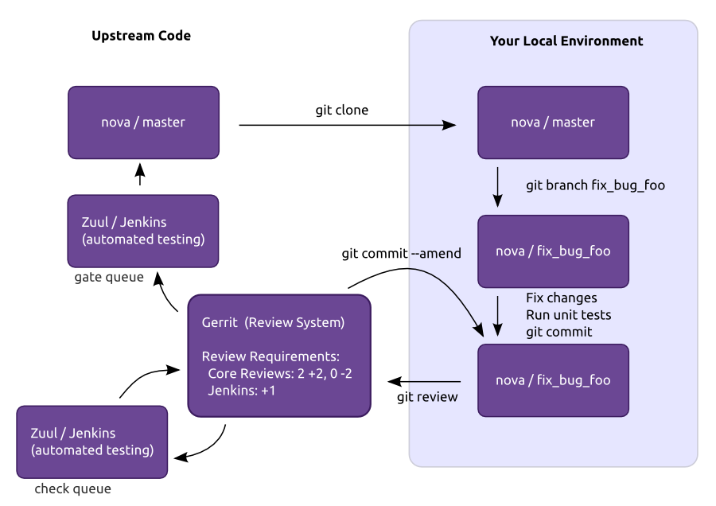
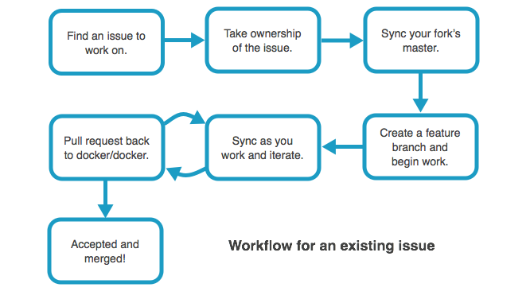

Unused slide content

---

Linux Kernel

===

### Release

* Time based release model (2-3 months)
* Rolling development model, continually integrating major changes
* Separate stable team
* Release single artifact
* Rarely consumed directly by end users

<!--

* Merge window (rate of 1,000 changes per day). After that next 6 - 10 weeks are mainly to changes that fix problems.

-->

===

### Scaling Model

* Per month
    * 1,000 contributors
    * 5,000 to 7,000 patches
* Lieutenants / subsystem maintainers
    * 100-150 maintainers
* Chain of Trust
* No elections for technical positions
* Decentralized review process
    * Each maintainer has their own git tree
* Only about 1% of patches are directly merged by BDFL

===

### Hierarchy

1. BDFL
2. Subsystem maintainers
5. Contributors

Usually one layer of subsystem maintainer but sometimes up to three

===

### Tooling

* Communication
    * mailing lists
* Git
* No automated pre-commit CI
    * Yes post commit
* Code review
    * decentralized
    * more mailing lists

===

### Life of a Patch

*Process can be quick for minor fixes or take years for controversial changes*

1. Design
    * Prefer in the open, but not required
2. Early review via mailing list
    * Find correct maintainer
    * Submit patches via email
3. Wider review, accepted  by a subsystem maintainer's tree and into the -next trees.
4. Merged into mainline

---

Apache

===

### Release

* ASF is more of a governance umbrella and culture
* Each project does its own thing
* 150+ separate releases

===

### Scaling Model

* Separate projects
    * 4,431 committers
    * 150+ top level projects
* 740 contributors in past 12 months?
* In project scaling up to each project
    * Apache Spark had 570 contributors in past 12 months
    * OpenOffice had 31
* flat (ish) trust model
* 'Review then commit' vs. 'commit then review'

    In order to reduce friction and allow for diversity to emerge, rather than forcing
    a monoculture from the top ... each project is delegated authority over development
    of its software, and is given a great deal of latitude in designing its own technical
    charter and its own governing rules.

===

### Hierarchy

1. ASF Member
2. Project Management Committee
    * Makes technical decisions
3. Committer
3. Developer

    When the group felt that the person had "earned" the merit to be part of the
    development community, they granted direct access to the code repository, thus
    increasing the group and increasing the ability of the group to develop the
    program, and to maintain and develop it more effectively.
===

### Tooling

* Communication
    * mailing list
* SVN
* Optional CI
* Central review system: [Review Board](https://reviews.apache.org/r/)
* Lazy consensus

>    If it didn't happen on a mailing list, it didn't happen.

===

### Life of a Patch

* Different projects have different review flows
* *Review then commit* or *commit then review*.
* [Review Board](https://reviews.apache.org/r/)

---

Debian

===

### Release

When its ready, not time based. Notoriously slow

* Every 2 years
* Lots and lots of artifacts
* Unstable, Testing, Stable

===

### Scaling Model

Package Maintainers

* 3,200 Debian Developers
* Can have individual maintainers or groups (via a mailing list)
* No review, trust/burden maintainers more

===

### Hierarchy

Roles

* **Maintainer**: the person making the Debian package of the program.
* **Sponsor**: a person who helps maintainers to upload packages to the official Debian package archive (after checking their contents).
* **Debian Developer (DD)**: a member of the Debian project with full upload rights to the official Debian package archive.
* **Debian Maintainer (DM)**: a person with limited upload rights to the official Debian package archive.

===

### Tooling

* Communication
    * Mailing list
    * Web services
    * Lots of IRC
* Poor automated testing
    * Quality control is ultimately to individual maintainers
    * Half of the CI available isn't official
* No peer review system
    * Except for new packages (FTP Masters)

===

openstack

===

### Release

* Time based, every 6 months
* Continuous delivery
* Set of separate but related projects.
    * Usually 1 way dependencies
* Lots of artifacts
* Sometimes consumed directly by consumers (without distro)
* No rolling development, freeze development on master before a release

===

<!--
At first OpenStack was an 'integrated release' of several projects. But coordinating a single integrated release became harder as OpenStack grew. Moving to model of more loosely integrated components that have a less integrated release cycle.

Starting to evolve

-->

===

### Scaling Model

* Break down repositories and build teams around each repository
    * 31 teams
    * 150+ repositories
    * 5,000 commits per month from 500 contributors
    * 282 core developers
* Flat trust model
* Strong centralized review process (two core reviews)
* Automated testing to reduce reviewer burden
* Having trouble with scaling the team responsible for a single repository
    *  Can't get past 15 or so members on a core team

===

### Hierarchy

Flat as possible

1. TC
2. PTL
3. Core Teams

===

### Tooling

* Communication
    * Mailing lists
    * IRC
    * Code reviews
* Git
* Code review: [Gerrit](review.openstack.org)
* Lots and lots of automated testing
* In person design summits twice a year

===

### Life of a Patch

===

docker

---

### Release

* Every 2 Months
* separate release branch
    * master isn't frozen

===

### Scaling Model

* 37 maintainers in Docker
* 10-15 repos in total
* Maintainers / subsystem maintainers
    * <small>Have to submit a pull request when going on vacation!</small>
* No don't direct push
* Centralized review in github

    1) They share responsibility in the project's success.
    2) They have made a long-term, recurring time investment to improve the project.
    3) They spend that time doing whatever needs to be done, not necessarily what
    is the most interesting or fun."

    This "cellular division" is the primary mechanism for scaling maintenance of the
    project as it grows.

<!--
Not followed

    A change requires LGTMs from an absolute majority of the maintainers of each
    component affected.

-->

===

### Hierarchy

1. BDFL
2. Project Leader (day to day work)
3. Core maintainers
4. Subsystem maintainers
5. Contributors

===

### BDFL

    Ideally, the BDFL role is like the Queen of England: awesome crown, but not
    an actual operational role day-to-day. The real job of a BDFL is to NEVER GO AWAY.
    ... the BDFL will always be there, preserving the philosophy and principles of the
    project, and keeping ultimate authority over its fate. This gives us great
    flexibility in experimenting with various governance models, knowing that we can
    always press the "reset" button without fear of fragmentation or deadlock. See the
    US congress for a counter-example.

    BDFL daily routine:

    * Is the project governance stuck in a deadlock or irreversibly fragmented?
        * If yes: refactor the project governance
    * Are there issues or conflicts escalated by core?
        * If yes: resolve them
    * Go back to polishing that crown.

===

### Tooling

* Communication
    * IRC
    * Google groups
    * Pull request (all decisions are a pull request)
* Git
* Github
* CI
    * Jenkins
    * Gate pull requests

===

### Life of a Patch

5 States of a review

1. Triage
    * Check DCO etc.
    * Partially automated
2. Design review
3. Code review
4. Docs review
5. Merge

<small>Commit message bodies are optional!</small>

===

### Life of a Patch

===

